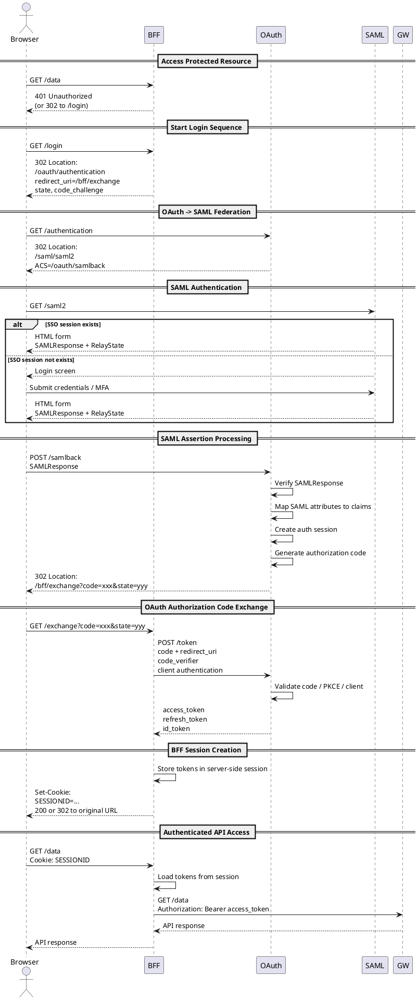

# DNS Infrastructure

家庭内 DNS / 認証実験環境用 Infrastructure as Code 管理ディレクトリ。

Raspberry Pi 上に構築した Pi-hole / dnsmasq を
Ansible により構成管理する。

---

## 目的

このディレクトリでは、家庭内 DNS と認証検証基盤を管理する。

主な用途は以下。

- ローカル開発用 DNS
- OIDC / SAML フェデレーション検証
- Keycloak 検証環境
- `*.test` ドメインによる名前解決
- 広告ブロック
- Reverse Proxy / HTTPS 検証
- WebAuthn / FIDO2 検証基盤

---

## 構成

```text
dns/
├── ansible.cfg
├── playbook.yml
├── inventory/
│   └── hosts.yml
│
├── resources/
│   └── id_rsa
│
└── roles/
    └── pihole/
        ├── tasks/
        │   └── main.yml
        │
        ├── handlers/
        │   └── main.yml
        │
        └── templates/
            └── dnsmasq.conf.j2
```plantuml
# SAML Federation + OAuth/OIDC + BFF 学習環境

## 概要

このリポジトリは以下を理解するための学習環境です。

* SAML Federation
* OAuth 2.0 / OpenID Connect
* Authorization Code Flow
* PKCE
* BFF (Backend For Frontend)
* SSO (Single Sign-On)
* Cookie / Session / Token の責務分離

単に「ログインできた」を目指すのではなく、

* 誰が Cookie を持っているのか
* 誰が Token を持っているのか
* 誰が 302 Redirect を返しているのか
* ブラウザが何を運んでいるのか

を HTTP Request / Response 単位で追いながら理解することを目的としています。

---

# アーキテクチャ

```text
Browser
   ↓
React (PR)
   ↓
BFF (Spring Boot)
   ↓
Protected API (FastAPI)
   ↓
Keycloak (OIDC Realm)
   ↓ Federation
Keycloak (SAML Realm)
```

---

# ディレクトリ構成

```text
.
├── pr
│   └── Dockerfile
│
├── bff
│   └── Dockerfile
│
├── api
│   └── Dockerfile
│
├── keycloak
│   ├── realm
│   └── themes
│
└── compose.yml
```

---

# 採用予定技術

| レイヤ           | 技術                                   |
| ------------- | ------------------------------------ |
| Frontend (PR) | React + Vite + TypeScript            |
| BFF           | Java + Spring Boot + Spring Security |
| API           | Python + FastAPI                     |
| 認証基盤          | Keycloak                             |
| Federation    | SAML 2.0                             |
| 認可            | OAuth 2.0 / OpenID Connect           |
| Session管理     | Cookie + Server-side Session         |
| API認可         | JWT Bearer Token                     |

---

# この構成で理解したいこと

## Browser は「状態輸送装置」

SAML/OIDC Federation において Browser 自身は:

* SAML Assertion
* JWT
* Authorization Code
* Access Token

を理解していません。

Browser が行っていることは:

* Redirect に従う
* Cookie を保持する
* Form を submit する
* JavaScript を実行する

だけです。

つまり Browser は:

> 認証状態を輸送するための装置

として動作しています。

---

# 責任分界点

| コンポーネント    | 責務                              |
| ---------- | ------------------------------- |
| Browser    | Session Cookie の保持・輸送           |
| BFF        | Access Token / Refresh Token 管理 |
| OAuth/OIDC | Authorization / Federation      |
| SAML IdP   | 認証                              |
| API        | JWT Validation                  |

---

# なぜ BFF を分けるのか

BFF を分離すると:

* Browser Session
* OAuth Session
* SAML Session
* Access Token
* Refresh Token

の責務がきれいに分かれます。

これにより:

* 「誰が Cookie を持つのか」
* 「誰が Token を持つのか」
* 「誰が Redirect を返しているのか」

が非常に見えやすくなります。

---

# 認証フロー概要

## 初回 API アクセス

```text
Browser
 → BFF /data
 ← 401 Unauthorized
```

Frontend は 401 を受け取りログインを開始します。

---

# ログイン開始

```text
Browser
 → BFF /login
 ← 302 redirect to OAuth
```

BFF は:

* state
* PKCE code_challenge
* redirect_uri

を生成します。

---

# OAuth → SAML Federation

```text
Browser
 → OAuth /authentication
 ← 302 redirect to SAML IdP
```

---

# SAML 認証

SSO Session が存在する場合:

* Login画面は表示されない

存在しない場合:

* Password入力
* MFA
* WebAuthn

などが発生します。

---

# SAML POST Binding

SAMLResponse は巨大な XML になるため、
URL Redirect に載せることができません。

そのため SAML では:

## POST Binding

が利用されます。

IdP は:

* HTTP 200
* HTML Form
* hidden SAMLResponse
* auto submit JavaScript

を Browser に返却します。

例:

```html
<form action="/oauth/samlback" method="post">
  <input type="hidden" name="SAMLResponse" value="..." />
</form>

<script>
document.forms[0].submit()
</script>
```

つまり:

* Browser が HTML を受信
* JavaScript が Form.submit()
* Browser が ACS に POST

を行います。

---

# ACS (Assertion Consumer Service)

OAuth サーバは:

```text
/oauth/samlback
```

を公開します。

この endpoint は:

* SAMLResponse 検証
* Signature検証
* 属性抽出
* Claim Mapping
* Authorization Session 作成

を行います。

---

# Authorization Code Flow

SAML 認証成功後:

```text
Browser
 ← 302 /bff/exchange?code=xxx
```

が返却されます。

BFF は:

```text
POST /oauth/token
```

を実行して:

* access_token
* refresh_token
* id_token

を取得します。

---

# BFF Session

BFF は取得した token を:

* Server-side Session

に保存します。

Browser に返すのは:

```text
SESSIONID Cookie
```

のみです。

つまり Browser は Access Token を保持しません。

---

# 認証後 API 呼び出し

```text
Browser
 → BFF /data
   Cookie: SESSIONID
```

BFF は session から token を取得し:

```text
Authorization: Bearer xxx
```

を付与して API を呼び出します。

---

# シーケンス図


